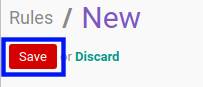

# Membuat Audit Rules

## A. INPUT

*(Tidak ada instruksi khusus)*

## B. LANGKAH KERJA

1. Buka menu **Reporting -> Audit -> Rules**. Abaikan jika sudah berada pada menu yang dimaksud.
2. Klik tombol **Create** pada bagian atas-kiri form.

3. Isi **[Name](./penjelasan.md#field-name)**. Wajib diisi.
4. Pilih **[Model](./penjelasan.md#field-model)**. Wajib diisi.
5. Pilih **[Type](./penjelasan.md#field-type)**. Wajib diisi.
6. Aktifkan/ Deaktifkan **[Log Reads](./penjelasan.md#field-log-reads)**. Tidak wajib diisi.
7. Aktifkan/ Deaktifkan **[Log Writes](./penjelasan.md#field-log-writes)**. Tidak wajib diisi.
8. Aktifkan/ Deaktifkan **[Log Deletes](./penjelasan.md#field-log-deletes)**. Tidak wajib diisi.
9. Aktifkan/ Deaktifkan **[Log Creates](./penjelasan.md#field-log-creates)**. Tidak wajib diisi.
10. Aktifkan/ Deaktifkan **[Log Methods](./penjelasan.md#field-log-methods)**. Tidak wajib diisi.
11. Klik tombol **Save** pada bagian atas-kiri form.

## C. OUTPUT

*(Tidak ada instruksi khusus)*
