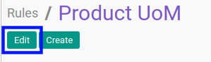
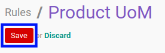

# Memodifikasi Audit Rules

## A. INPUT

*(Tidak ada instruksi khusus)*

## B. LANGKAH KERJA

1. Buka menu **Reporting -> Audit -> Rules**. Abaikan jika sudah berada pada menu yang dimaksud.
2. Buka data *Audit Rules* yang akan dimodifikasi. Abaikan jika data sudah dibuka.
3. Klik tombol **Edit** pada bagian atas-kiri form.

4. Isi dan sesuaikan **[Name](./penjelasan.md#field-name)** jika dibutuhkan. Wajib diisi.
5. Pilih dan sesuaikan **[Model](./penjelasan.md#field-model)** jika dibutuhkan. Wajib diisi.
6. Pilih dan sesuaikan **[Type](./penjelasan.md#field-type)** jika dibutuhkan. Wajib diisi.
7. Aktifkan/ Deaktifkan **[Log Reads](./penjelasan.md#field-log-reads)** jika dibutuhkan. Tidak wajib diisi.
8. Aktifkan/ Deaktifkan **[Log Writes](./penjelasan.md#field-log-writes)** jika dibutuhkan. Tidak wajib diisi.
9. Aktifkan/ Deaktifkan **[Log Deletes](./penjelasan.md#field-log-deletes)** jika dibutuhkan. Tidak wajib diisi.
10. Aktifkan/ Deaktifkan **[Log Creates](./penjelasan.md#field-log-creates)** jika dibutuhkan. Tidak wajib diisi.
11. Aktifkan/ Deaktifkan **[Log Methods](./penjelasan.md#field-log-methods)** jika dibutuhkan. Tidak wajib diisi.
12. Klik tombol **Save** pada bagian atas-kiri form.

## C. OUTPUT

* Data Audit Rules akan berubah sesuai dengan perubahan yang dilakukan.
