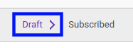

# Menerapkan Audit Rules

## A. INPUT

* Data *Audit Rules* yang akan diterapkan harus memiliki status **Draft**

## B. LANGKAH KERJA

1. Buka menu **Reporting -> Audit -> Rules**. Abaikan jika sudah berada pada menu yang dimaksud.
2. Buka data *Audit Rules* yang akan diterapkan. Abaikan jika data sudah dibuka.
3. Klik tombol **Subscribe** pada bagian atas-kiri form.

## C. OUTPUT

* Data Audit Rules akan diterapkan dalam sistem.
