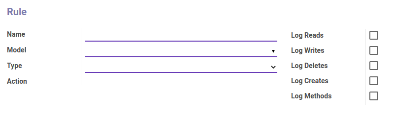

# Penjelasan Audit Rules

Informasi pada Menu Audit Rules dibagi menjadi beberapa area, diantaranya:

* [Header](#bagian-header)

### <a name="bagian-header">HEADER</a>

#### <a name="field-name">Name</a>

Nama Audit Rules.

#### <a name="field-model">Model</a>

Model Audit Rules yang digunakan.

### <a name="field-type">Type</a>

Tipe Log.

#### <a name="field-action">Action</a>

Tindakan yang dilakukan.

### <a name="field-log-reads">Log Reads</a>

Status aktif Log Reads.

### <a name="field-log-writes">Log Writes</a>

Status aktif Log Writes.

### <a name="field-log-deletes">Log Deletes</a>

Status aktif Log Deletes.

### <a name="field-log-creates">Log Creates</a>

Status aktif Log Creates.

### <a name="field-log-methods">Log Methods</a>

Status aktif Log Methods.
