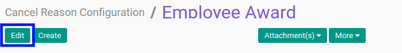

# Memodifikasi Cancel Reason Configuration

## A. INPUT

*(Tidak ada instruksi khusus)*

## B. LANGKAH KERJA

1. Buka menu **Setting -> Cancel Reason -> Cancel Reason Configuration**. Abaikan jika sudah berada pada menu yang dimaksud.
2. Buka data *Cancel Reason Configuration* yang akan dimodifikasi. Abaikan jika data sudah dibuka.
3. Klik tombol **Edit** pada bagian atas-kiri form.

4. Beralih ke tab **[Reasons](./penjelasan.md#tab-reasons)**.
5. Tambah/Hapus **Cancel Reason**. Ulangi langkah ini sampai **Cancel Reason** sesuai dengan keinginan.
6. Beralih ke tab **[Notes](./penjelasan.md#tab-notes)**.
7. Isi dan sesuaikan **[Notes](./penjelasan.md#tab-notes)** jika dibutuhkan. Tidak wajib diisi.
8. Klik tombol **Save** pada bagian atas-kiri form.

## C. OUTPUT

* Data Cancel Reason Configuration akan berubah sesuai dengan perubahan yang dilakukan.
