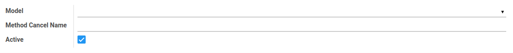
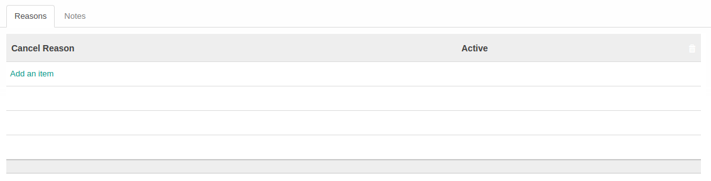
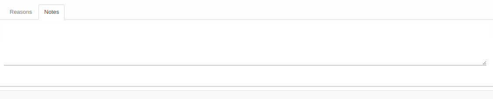

# Penjelasan Cancel Reason Configuration

Informasi pada Menu Cancel Reason Configurator dibagi menjadi beberapa area, diantaranya:

* [Header](#bagian-header)
* [Tab Reasons](#tab-reasons)
* [Tab Notes](#tab-notes)

### <a name="bagian-header">HEADER</a>

#### <a name="field-model">Model</a>

Model Cancel Reason Configuration.

#### <a name="field-method-cancel-name">Method Cancel Name</a>

Nama metode pembatalan.

#### <a name="field-active">Active</a>

Status aktif Cancel Reason Configuration.

### <a name="tab-reasons">TAB REASONS</a>

#### <a name="field-cancel-reason">Cancel Reason</a>

Item Cancel Reason yang digunakan.

#### <a name="field-reasons-active">Active</a>

Status aktif item Cancel Reason yang digunakan.

### <a name="tab-notes">TAB NOTES</a>

Catatan.
