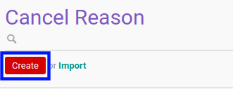

# Membuat Cancel Reason

## A. INPUT

*(Tidak ada instruksi khusus)*

## B. LANGKAH KERJA

1. Buka menu **Setting -> Cancel Reason -> Cancel Reason**. Abaikan jika sudah berada pada menu yang dimaksud.
2. Klik tombol **Create** pada bagian atas-kiri form.

3. Isi **[Cancel Reason](./penjelasan.md#field-cancel-reason)**. Wajib diisi.
4. Aktifkan/ Deaktifkan **[Active](./penjelasan.md#field-active)**. Tidak wajib diisi.
5. Beralih ke tab **[Notes](./penjelasan.md#tab-notes)**.
6. Isi **[Notes](./penjelasan.md#tab-notes)**. Tidak wajib diisi.
7. Klik tombol **Save** pada bagian atas-kiri form.

## C. OUTPUT

*(Tidak ada instruksi khusus)*
