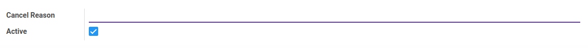
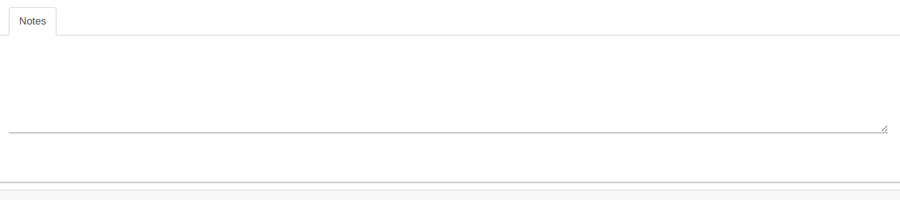

# Penjelasan Cancel Reason

Informasi pada Menu Cancel Reason dibagi menjadi beberapa area, diantaranya:

* [Header](#bagian-header)
* [Tab Notes](#tab-notes)

### <a name="bagian-header">HEADER</a>

#### <a name="field-cancel-reason">Cancel Reason</a>

Alasan Pembatalan.

#### <a name="field-active">Active</a>

Status aktif Cancel Reason.

### <a name="tab-notes">TAB NOTES</a>

Catatan.
