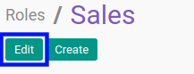

# Memodifikasi Role

## A. INPUT

*(Tidak ada instruksi khusus)*

## B. LANGKAH KERJA

1. Buka menu **Setting -> User -> Roles**. Abaikan jika sudah berada pada menu yang dimaksud.
2. Buka data *Role* yang akan dimodifikasi. Abaikan jika data sudah dibuka.
3. Klik tombol **Edit** pada bagian atas-kiri form.

4. Isi dan sesuaikan **[Name](./penjelasan.md#field-name)** jika dibutuhkan. Wajib diisi.
5. Beralih ke tab **[Groups](./penjelasan.md#tab-groups)**.
6. <a name="l9">[Tambah](./menambah-group.md)/[Hapus](./menghapus-group.md)</a>  **Group Role**. Ulangi langkah ini sampai **Group Role** sesuai dengan keinginan.
7. Klik tombol **Save** pada bagian atas-kiri form.

## C. OUTPUT

* Data Role akan berubah sesuai dengan perubahan yang dilakukan.
