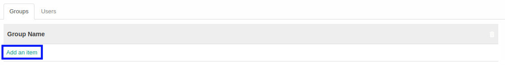
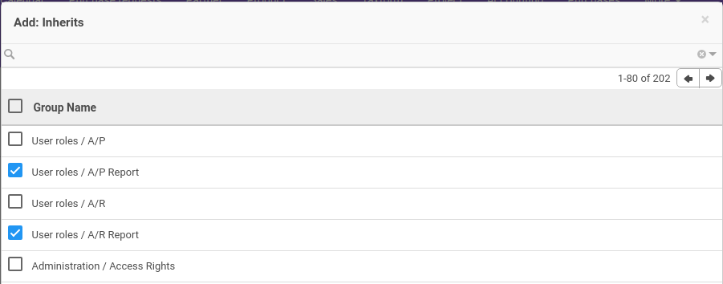
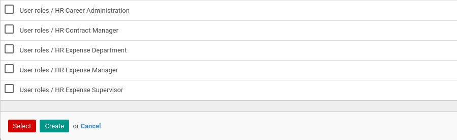
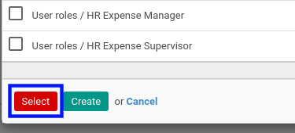

# Menambah Group Role

*(Instruksi kerja ini merupakan sub instruksi dari (1) [Membuat Role](./membuat.md), atau (2) [Memodifikasi Role](./memodifikasi.md). Instruksi kerja ini tidak bisa berdiri sendiri)*

## A. INPUT

*(Tidak ada instruksi khusus)*

## B. LANGKAH KERJA

1. Klik label **Add an Item** pada tabel *Groups*.

Pop-up **Group Role** akan muncul.

2. Seleksi data Group Role.
3. Klik tombol **Select** pada bagian bawah-kiri pop-up Group Role.

4. Lanjutkan [langkah ke-6 instruksi Membuat Role](./membuat.md#l6) atau [langkah ke-7 instruksi Memodifikasi Role](./memodifikasi.md#l7).

## C. OUTPUT

*(Tidak ada instruksi khusus)*
