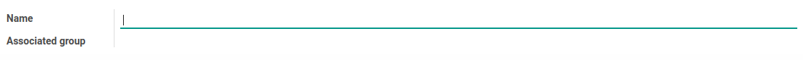
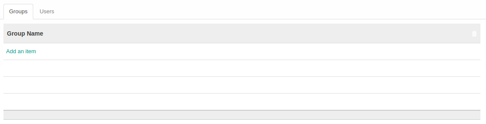
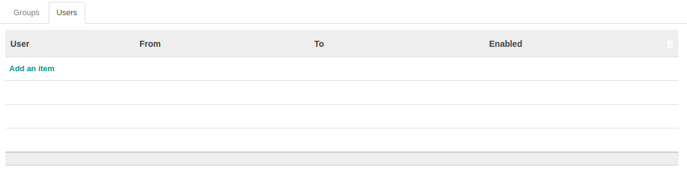

# Penjelasan Role

Informasi pada Menu Role dibagi menjadi beberapa area, diantaranya:

* [Header](#bagian-header)
* [Tab Groups](#tab-groups)
* [Tab Users](#tab-users)

### <a name="bagian-header">HEADER</a>

#### <a name="field-name">Name</a>

Nama Role.

#### <a name="field-group">Associated Group</a>

Group yang terhubung.

### <a name="tab-groups">TAB GROUPS</a>

#### <a name="field-group-name">Group Name</a>

Nama Group.

### <a name="tab-users">TAB USERS</a>

#### <a name="field-user">User</a>

Nama User.

#### <a name="field-from">From</a>

Tanggal awal User.

#### <a name="field-to">To</a>

Tanggal akhir User.

#### <a name="field-enabled">Enabled</a>

Status aktif User.
