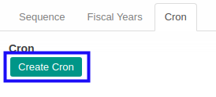
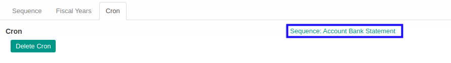
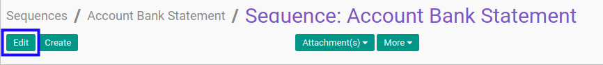

# Membuat Cron Untuk Mereset Sequence

## A. INPUT

*(Tidak ada instruksi khusus)*

## B. LANGKAH KERJA

1. Buka menu **Setting -> Technical -> Sequences & Identifiers -> Sequences**. Abaikan jika sudah berada pada menu yang dimaksud.
2. Buka data *Sequence* yang akan dibuat *Cron*. Abaikan jika data sudah dibuka.
3. Beralih ke tab **[Cron](./penjelasan.md#tab-cron)**.
4. Klik tombol **Create Cron** pada bagian atas-kiri tab.

5. Klik data *Cron* yang muncul ketika tombol **Create Cron** diklik.

6. Klik tombol **Edit** pada bagian atas-kiri form.

7. Isi **[Name](./penjelasan.md#field-name-cron)**. Wajib diisi.
8. Pilih **[User](./penjelasan.md#field-user)**. Wajib diisi.
9. Aktifkan/ Deaktifkan **[Active](./penjelasan.md#field-cron-active)**. Tidak wajib diisi.
10. Isi **[Priority](./penjelasan.md#field-priority)**. Tidak wajib diisi.
11. Beralih ke tab **[Information](./penjelasan.md#tab-information-cron)**.
12. Isi **[Interval Number](./penjelasan.md#field-interval-number)**. Wajib diisi.
13. Pilih **[Interval Unit](./penjelasan.md#field-interval-unit)**. Wajib diisi.
14. Pilih **[Next Execution Date](./penjelasan.md#field-next-execution-date)**. Wajib diisi.
15. Isi **[Number of Calls](./penjelasan.md#field-number-of-calls)**. Wajib diisi.
16. Aktifkan/ Deaktifkan **[Repeat Missed](./penjelasan.md#field-repeat-missed)**. Tidak wajib diisi.
17. Klik tombol **Save** pada bagian atas-kiri form.

## C. OUTPUT

*(Tidak ada instruksi khusus)*
