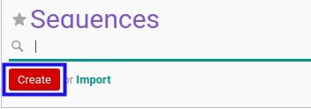
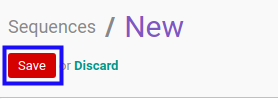

# Membuat Sequence

## A. INPUT

*(Tidak ada instruksi khusus)*

## B. LANGKAH KERJA

1. Buka menu **Setting -> Technical -> Sequences & Identifiers -> Sequences**. Abaikan jika sudah berada pada menu yang dimaksud.
2. Klik tombol **Create** pada bagian atas-kiri form.

3. Isi **[Name](./penjelasan.md#field-name)**. Wajib diisi.
4. Pilih **[Company](./penjelasan.md#field-company)**. Wajib diisi.
5. Pilih **[Sequence Type](./penjelasan.md#field-sequence-type)**. Tidak wajib diisi.
6. Aktifkan/ Deaktifkan **[Active](./penjelasan.md#field-active)**. Tidak wajib diisi.
7. Beralih ke tab **[Sequence](./penjelasan.md#tab-sequence)**.
8. Isi **[Prefix](./penjelasan.md#field-prefix)**. Tidak wajib diisi.
9. Isi **[Suffix](./penjelasan.md#field-suffix)**. Tidak wajib diisi.
10. Isi **[Number Padding](./penjelasan.md#field-number-padding)**. Wajib diisi.
11. Isi **[Next Number](./penjelasan.md#field-next-number)**. Wajib diisi.
12. Isi **[Increment Number](./penjelasan.md#field-increment-number)**. Wajib diisi.
13. Pilih **[Implementation](./penjelasan.md#field-implementation)**. Wajib diisi.
14. Klik tombol **Save** pada bagian atas-kiri form.

## C. OUTPUT

*(Tidak ada instruksi khusus)*
