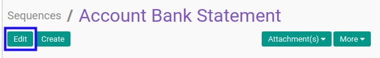
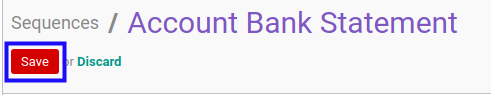

# Memodifikasi Sequence

## A. INPUT

*(Tidak ada instruksi khusus)*

## B. LANGKAH KERJA

1. Buka menu **Setting -> Technical -> Sequences & Identifiers -> Sequences**. Abaikan jika sudah berada pada menu yang dimaksud.
2. Buka data *Sequence* yang akan dimodifikasi. Abaikan jika data sudah dibuka.
3. Klik tombol **Edit** pada bagian atas-kiri form.

4. Isi dan sesuaikan **[Name](./penjelasan.md#field-name)** jika dibutuhkan. Wajib diisi.
5. Pilih dan sesuaikan **[Company](./penjelasan.md#field-company)** jika dibutuhkan. Wajib diisi.
6. Pilih dan sesuaikan **[Sequence Type](./penjelasan.md#field-sequence-type)** jika dibutuhkan. Tidak wajib diisi.
7. Aktifkan/ Deaktifkan **[Active](./penjelasan.md#field-active)** jika dibutuhkan. Tidak wajib diisi.
8. Beralih ke tab **[Sequence](./penjelasan.md#tab-sequence)**.
9. Isi dan sesuaikan **[Prefix](./penjelasan.md#field-prefix)** jika dibutuhkan. Tidak wajib diisi.
10. Isi dan sesuaikan **[Suffix](./penjelasan.md#field-suffix)** jika dibutuhkan. Tidak wajib diisi.
11. Isi dan sesuaikan **[Number Padding](./penjelasan.md#field-number-padding)** jika dibutuhkan. Wajib diisi.
12. Isi dan sesuaikan **[Next Number](./penjelasan.md#field-next-number)** jika dibutuhkan. Wajib diisi.
13. Isi dan sesuaikan **[Increment Number](./penjelasan.md#field-increment-number)** jika dibutuhkan. Wajib diisi.
14. Pilih dan sesuaikan **[Implementation](./penjelasan.md#field-implementation)** jika dibutuhkan. Wajib diisi.
15. Klik tombol **Save** pada bagian atas-kiri form.

## C. OUTPUT

* Data Sequence akan berubah sesuai dengan perubahan yang dilakukan.
