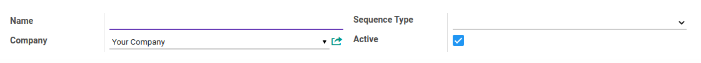
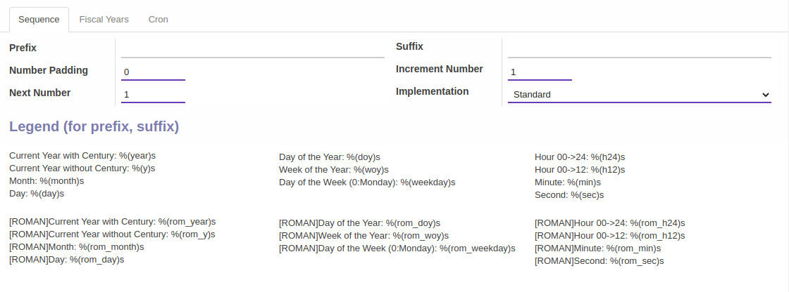
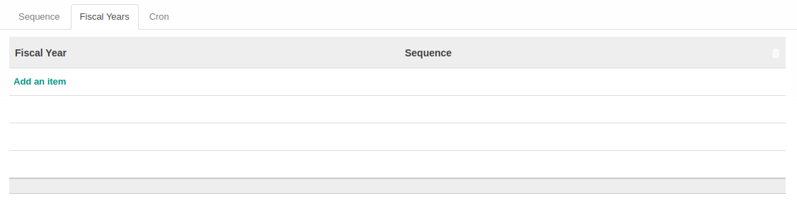
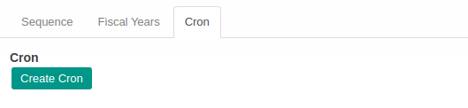
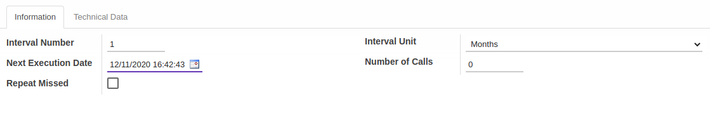
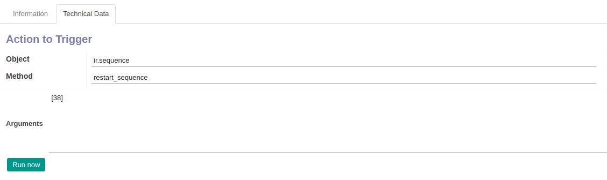

# Penjelasan Sequence

Informasi pada Menu User dibagi menjadi beberapa area, diantaranya:

* [Header](#bagian-header)
* [Tab Sequence](#tab-sequence)
* [Tab Fiscal Years](#tab-fiscal-years)
* [Tab Cron](#tab-cron)

### <a name="bagian-header">HEADER</a>

#### <a name="field-name">Name</a>

Nama Sequence.

#### <a name="field-company">Company</a>

Perusahaan yang menggunakan sequence.

#### <a name="field-sequence-type">Sequence Type</a>

Tipe sequence.

#### <a name="field-active">Active</a>

Penanda status sequence aktif.

### <a name="tab-sequence">TAB SEQUENCE</a>

#### <a name="field-prefix">Prefix</a>

Karakter yang digunakan sebelum nomor urut dokumen.

#### <a name="field-suffix">Suffix</a>

Karakter yang digunakan setelah nomor urut dokumen.

#### <a name="field-number-padding">Number Padding</a>

Jumlah karakter nomor dokumen.

#### <a name="field-next-number">Next Number</a>

Nomor urut dokumen yang digunakan pada transaksi selanjutnya.

#### <a name="field-increment-number">Increment Number</a>

Nilai yang ditambahkan pada Next Number setelah transaksi menghasilkan nomor dokumen.

#### <a name="field-implementation">Implementation</a>

Skenario implementasi urutan nomor dokumen.

### <a name="tab-fiscal-years">TAB FISCAL YEARS</a>

#### <a name="field-fiscal-year">Fiscal Year</a>

Tahun fiskal implementasi sequence.

#### <a name="field-sequence">Sequence</a>

Sequence yang digunakan pada tahun fiskal.

### <a name="tab-cron">TAB CRON</a>

#### <a name="field-cron">Cron</a>

Pengaturan reset sequence untuk periode tertentu.

### TAMPILAN CRON:

### <a name="bagian-header-cron">HEADER</a>

#### <a name="field-name-cron">Name</a>

Nama Cron.

#### <a name="field-user">User</a>

User yang membuat Cron.

#### <a name="field-cron-active">Active</a>

Penanda status cron aktif.

#### <a name="field-priority">Priority</a>

Urutan prioritas Cron.

### <a name="tab-information-cron"> TAB INFORMATION</a>

#### <a name="field-interval-number">Interval Number</a>

Pengaturan jumlah interval reset penomoran dokumen.

#### <a name="field-interval-unit">Interval Unit</a>

Pengaturan unit waktu untuk interval reset penomoran dokumen.

#### <a name="field-next-execution-date">Next Execution Date</a>

Pengaturan waktu selanjutnya untuk reset penomoran dokumen.

#### <a name="field-number-of-calls">Number of Calls</a>

Pengaturan pengulangan reset dokumen.

#### <a name="field-repeat-missed">Repeat Missed</a>

Pengaturan pengulangan jika ada kesalahan dalam transaksi.

### <a name="tab-technical-data-cron">TAB TECHNICAL DATA</a>

#### <a name="field-object">Object</a>

to-do.

#### <a name="field-method">Method</a>

to-do.
