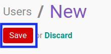

# Membuat User Non-Portal

## A. INPUT

*(Tidak ada instruksi khusus)*

## B. LANGKAH KERJA

1. Buka menu **Setting -> User -> User**. Abaikan jika sudah berada pada menu yang dimaksud.
2. Klik tombol **Create** pada bagian atas-kiri form.

3. Isi **[Name](./penjelasan.md#field-name)**. Wajib diisi.
4. Isi **[Email Address](./penjelasan.md#field-email)**. Wajib diisi.
5. Aktifkan/ Deaktifkan **[Active](./penjelasan.md#field-active)**. Tidak wajib diisi.
6. Beralih ke tab **[Role](./penjelasan.md#tab-role)**.
7. <a name="l9">[Tambah](./menambah-user-role.md)/[Modifikasi](./memodifikasi-user-role.md)/[Hapus](./menghapus-user-role.md)</a>  **Role**. Ulangi langkah ini sampai **Role** sesuai dengan keinginan.
8. Beralih ke tab **[Preferences](./penjelasan.md#tab-preference)**.
9. Pilih **[Language](./penjelasan.md#field-localization)**. Tidak wajib diisi.
10. Pilih **[Timezone](./penjelasan.md#field-localization)**. Tidak wajib diisi.
11. Pilih **[Home Action](./penjelasan.md#field-menu-customization)**. Tidak wajib diisi.
12. Pilih **[Receive Inbox Notifications by Email](./penjelasan.md#field-messaging-social)**. Tidak wajib diisi.
13. Isi **[Messaging Alias](./penjelasan.md#field-messaging-social)**. Tidak wajib diisi.
14. Pilih **[Alias Accepts Emails From](./penjelasan.md#field-messaging-social)**. Tidak wajib diisi.
15. Aktifkan/ Deaktifkan **[Display Groups Suggestions](./penjelasan.md#field-messaging-social)**. Tidak wajib diisi.
16. Isi **[Signature](./penjelasan.md#field-messaging-social)**. Tidak wajib diisi.
17. Pilih **[Map Website](./penjelasan.md#field-maps)**. Tidak wajib diisi.
18. Pilih **[Route Map Website](./penjelasan.md#field-maps)**. Tidak wajib diisi.
19. Isi **[Start Address for Route Map](./penjelasan.md#field-maps)**. Tidak wajib diisi.
20. Aktifkan/ Deaktifkan **[MFA Enabled](./penjelasan.md#field-mfa-settings)**. Tidak wajib diisi.
21. Isi **[Authentication Apps/Devices](./penjelasan.md#field-mfa-settings)**. Tidak wajib diisi.
22. Klik tombol **Save** pada bagian atas-kiri form.

## C. OUTPUT

*(Tidak ada instruksi khusus)*
