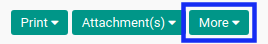
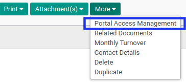
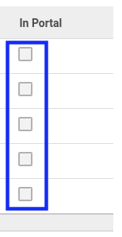

# Membuat User Portal

## A. INPUT

*(Tidak ada instruksi khusus)*

## B. LANGKAH KERJA

1. Buka menu **Partner -> Partner -> Company Partner**. Abaikan jika sudah berada pada menu yang dimaksud.
2. Buka data *partner* yang akan diberikan akses user portal.
3. Klik tombol **More** pada bagian atas-tengah form.

4. Klik tombol **Portal Access Management** pada drop-down yang muncul pada tombol **More**

5. Centang checkbox **In Portal** pada **Contact** yang akan diberikan akses user portal.

6. Klik tombol **Apply** pada bagian bawah-kiri form.

## C. OUTPUT

*(Tidak ada instruksi khusus)*
