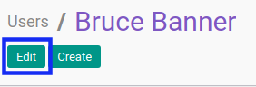
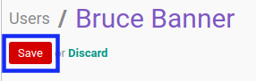

# Memodifikasi User

## A. INPUT

*(Tidak ada instruksi khusus)*

## B. LANGKAH KERJA

1. Buka menu **Setting -> User -> User**. Abaikan jika sudah berada pada menu yang dimaksud.
2. Buka data *User* yang akan dimodifikasi. Abaikan jika data sudah dibuka.
3. Klik tombol **Edit** pada bagian atas-kiri form.

4. Isi dan sesuaikan **[Name](./penjelasan.md#field-name)** jika dibutuhkan. Wajib diisi.
5. Isi dan sesuaikan **[Email Address](./penjelasan.md#field-email)** jika dibutuhkan. Wajib diisi.
6. Aktifkan/ Deaktifkan **[Active](./penjelasan.md#field-active)** jika dibutuhkan. Tidak wajib diisi.
7. Beralih ke tab **[Role](./penjelasan.md#tab-role)**
8. <a name="l9">[Tambah](./menambah-user-role.md)/[Modifikasi](./memodifikasi-user-role.md)/[Hapus](./menghapus-user-role.md)</a>  **Role**. Ulangi langkah ini sampai **Role** sesuai dengan keinginan.
9. Beralih ke tab **[Preferences](./penjelasan.md#tab-preference)**
10. Pilih dan sesuaikan **[Language](./penjelasan.md#field-localization)** jika dibutuhkan. Tidak wajib diisi.
11. Pilih dan sesuaikan **[Timezone](./penjelasan.md#field-localization)** jika dibutuhkan. Tidak wajib diisi.
12. Pilih dan sesuaikan **[Home Action](./penjelasan.md#field-menu-customization)** jika dibutuhkan. Tidak wajib diisi.
13. Pilih dan sesuaikan **[Receive Inbox Notifications by Email](./penjelasan.md#field-messaging-social)** jika dibutuhkan. Tidak wajib diisi.
14. Isi dan sesuaikan **[Messaging Alias](./penjelasan.md#field-messaging-social)** jika dibutuhkan. Tidak wajib diisi.
15. Pilih dan sesuaikan **[Alias Accepts Emails From](./penjelasan.md#field-messaging-social)** jika dibutuhkan. Tidak wajib diisi.
16. Aktifkan/ Deaktifkan **[Display Groups Suggestions](./penjelasan.md#field-messaging-social)** jika dibutuhkan. Tidak wajib diisi.
17. Isi dan sesuaikan **[Signature](./penjelasan.md#field-messaging-social)** jika dibutuhkan. Tidak wajib diisi.
18. Pilih dan sesuaikan **[Map Website](./penjelasan.md#field-maps)** jika dibutuhkan. Tidak wajib diisi.
19. Pilih dan sesuaikan **[Route Map Website](./penjelasan.md#field-maps)** jika dibutuhkan. Tidak wajib diisi.
20. Isi dan sesuaikan **[Start Address for Route Map](./penjelasan.md#field-maps)** jika dibutuhkan. Tidak wajib diisi.
21. Aktifkan/ Deaktifkan **[MFA Enabled](./penjelasan.md#field-mfa-settings)** jika dibutuhkan. Tidak wajib diisi.
22. Isi dan sesuaikan **[Authentication Apps/Devices](./penjelasan.md#field-mfa-settings)** jika dibutuhkan. Tidak wajib diisi.
23. Klik tombol **Save** pada bagian atas-kiri form.

## C. OUTPUT

* Data User akan berubah sesuai dengan perubahan yang dilakukan.
