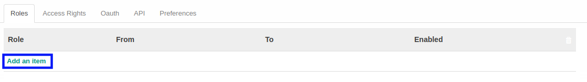

# Menambah User Role

*(Instruksi kerja ini merupakan sub instruksi dari (1) [Membuat User](./membuat-non-portal.md), atau (2) [Memodifikasi User](./memodifikasi.md). Instruksi kerja ini tidak bisa berdiri sendiri)*

## A. INPUT

*(Tidak ada instruksi khusus)*

## B. LANGKAH KERJA

1. Klik label **Add an Item** pada tabel *Roles*.

2. Isi **[Role](./penjelasan.md#field-role)**. Wajib diisi.
3. Isi **[From](./penjelasan.md#field-from)**. Tidak wajib diisi.
4. Isi **[To](./penjelasan.md#field-to)**. Tidak wajib diisi.
5. Aktifkan/ Deaktifkan **[Enabled](./penjelasan.md#field-enabled)**. Tidak wajib diisi.
6. Ulangi langkah ke-1 untuk menambahkan **Role** baru.
7. Lanjutkan [langkah ke-8 instruksi Membuat User](./membuat-non-portal.md#l8) atau [langkah ke-9 instruksi Memodifikasi User](./memodifikasi.md#l9).

## C. OUTPUT

*(Tidak ada instruksi khusus)*
