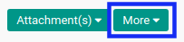
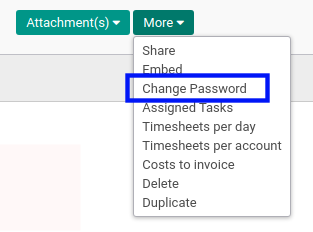
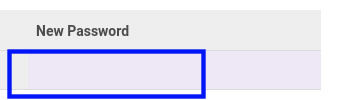

# Mengganti Password User

## A. INPUT

*(Tidak ada instruksi khusus)*

## B. LANGKAH KERJA

1. Buka menu **Setting -> User -> User**. Abaikan jika sudah berada pada menu yang dimaksud.
2. Buka data *User* yang akan diganti password. Abaikan jika data sudah dibuka.
3. Klik tombol **More** pada bagian atas-tengah form.

4. Klik tombol **Change Password** pada *dropdown* yang muncul ketika tombol **More** diklik.

5. Isi dan sesuaikan kolom *New Password* pada *pop-up* menu **Change Password** yang muncul.

5. Klik tombol **Change Password** pada bagian kiri-bawah *pop-up* menu **Change Password**.

## C. OUTPUT

* Data User akan tergantikan dengan Password baru.
