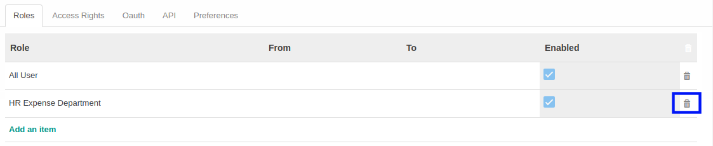

# Menghapus User Role

*(Instruksi kerja ini merupakan sub instruksi dari (1) [Membuat User](./membuat-non-portal.md), atau (2) [Memodifikasi User](./memodifikasi.md). Instruksi kerja ini tidak bisa berdiri sendiri)*

## A. INPUT

*(Tidak ada instruksi khusus)*

## B. LANGKAH KERJA

1. Klik icon tempat sampah pada bagian kanan **Role** yang akan dihapus.

2. Ulangi langkah ke-1 untuk setiap **Role** yang akan dihapus.
3. Lanjutkan [langkah ke-8 instruksi Membuat User](./membuat-non-portal.md#l8) atau [langkah ke-9 instruksi Memodifikasi User](./memodifikasi.md#l9).

## C. OUTPUT

*(Tidak ada instruksi khusus)*
