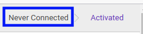
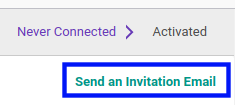
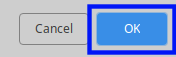

# Mengirimkan Email Aktivasi

## A. INPUT

* Data *User* yang akan dikirimkan email aktivasi harus memiliki status **Never Connected**

## B. LANGKAH KERJA

1. Buka menu **Setting -> User -> User**. Abaikan jika sudah berada pada menu yang dimaksud.
2. Buka data *User* yang akan dikirimkan email aktivasi. Abaikan jika data sudah dibuka.
3. Klik tombol **Send an Invitation Email** pada bagian atas-kanan form.

4. Klik tombol *Ok* pada *pop-up* menu **Confirmation** yang muncul.

## C. OUTPUT

* User akan mendapatkan email aktivasi.
