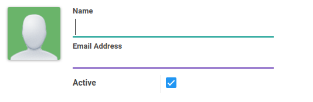
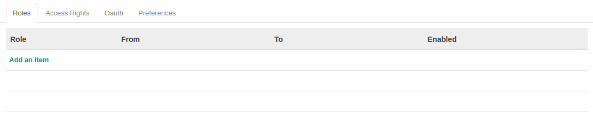
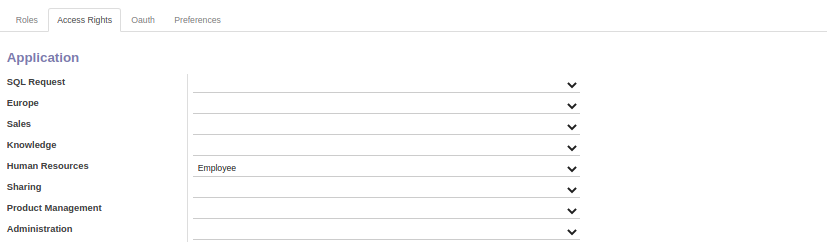
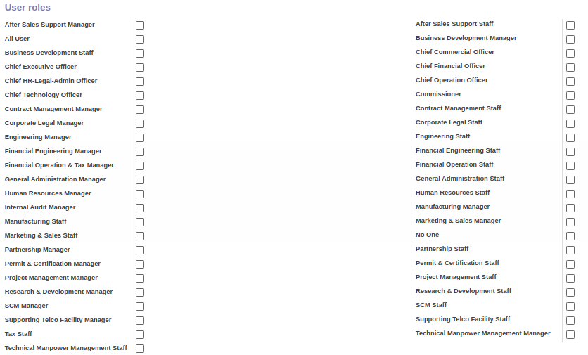
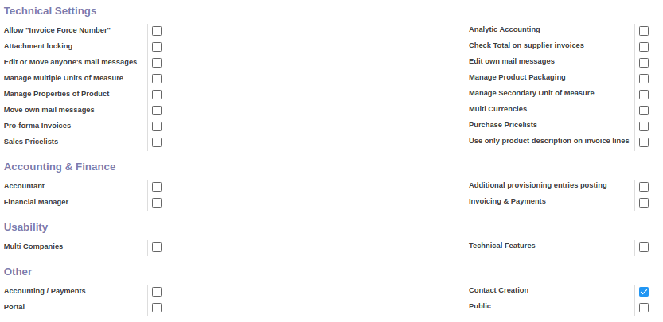
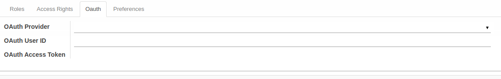
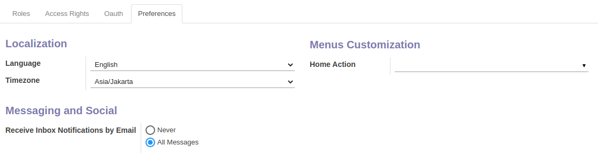
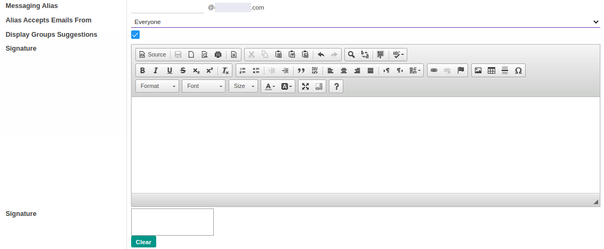
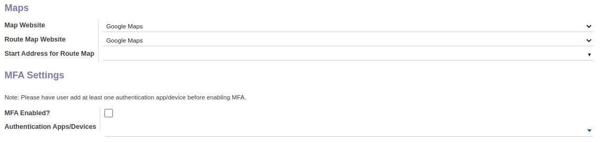

# Penjelasan User

Informasi pada Menu User dibagi menjadi beberapa area, diantaranya:

* [Header](#bagian-header)
* [Tab Role](#tab-role)
* [Tab Access Rights](#tab-access-rights)
* [Tab Oauth](#tab-oauth)
* [Tab Preference](#tab-preference)

### <a name="bagian-header">HEADER</a>

#### <a name="field-name">Name</a>

Nama User

#### <a name="field-email">Email Address</a>

Alamat Email User

#### <a name="field-active">Active</a>

Penanda status User aktif

### <a name="tab-role">TAB ROLE</a>

#### <a name="field-role">Role</a>

Nama Role

#### <a name="field-from">From</a>

Tanggal awal Role

#### <a name="field-to">To</a>

Tanggal akhir Role

#### <a name="field-enabled">Enabled</a>

Status aktif Role

### <a name="tab-access-rights">TAB ACCESS RIGHTS</a>

#### <a name="field-application">Application</a>

Daftar aplikasi yang dapat diakses dan digunakan oleh user

#### <a name="field-user-roles">User Roles</a>

Daftar Role User

#### <a name="field-technical-settings">Technical Settings</a>

Daftar pengaturan teknis yang dapat diakses dan digunakan oleh User

#### <a name="field-accounting-finance">Accounting & Finance</a>

Daftar pengaturan accounting & finance yang dapat diakses dan digunakan oleh User

#### <a name="field-usability">Usability</a>

Pengaturan penggunaan fitur yang dapat diakses dan digunakan oleh User

#### <a name="field-Other">Other</a>

Pengaturan fitur lainnya yang dapat diakses dan digunakan oleh User

### <a name="tab-oauth">TAB OAUTH</a>

#### <a name="field-oauth-provider">OAuth Provider</a>

Pengaturan penggunaan penyedia autentikasi OAuth

#### <a name="field-oauth-user-id">OAuth User ID</a>

Pengaturan informasi identitas User OAuth

#### <a name="field-oauth-access-token">OAuth Access Token</a>

Pengaturan informasi token akses OAuth

### <a name="tab-preference">TAB PREFERENCE</a>

#### <a name="field-localization">Localization</a>

Pengaturan informasi bahasa dan zona waktu

#### <a name="field-menu-customization">Menus Customization</a>

Pengaturan kustomisasi menu yang dapat diakses dan digunakan oleh user

#### <a name="field-messaging-social">Messaging and Social</a>

Pengaturan notifikasi pesan yang diterima oleh user, tampilan email dan signature

#### <a name="field-maps">Maps</a>

Pengaturan lokasi peta dan rute alamat

#### <a name="field-mfa-settings">MFA Settings</a>

Pengaturan autentikasi Multi-Factor Authentication aplikasi/ perangkat
